# Atividade prática Sonny Drummer

Abaixo seguem as instruções para reprodução do exemplo utilizado em sala de aula.
No momento esta é a primeira versão do tutorial em forma de Wiki, espero que voces apreciem, qual quer dica, sugestão ou crítica será bem-vinda.

# Primeira Parte: Criação do Projeto

### 1. Crie um novo projeto, selecionando uma `Empty Activity`, conforme imagem abaixo.

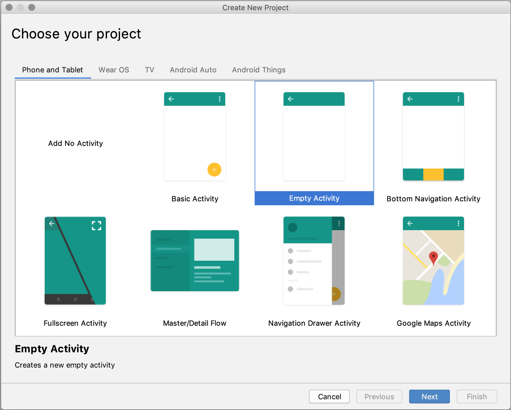

### 2. Cique em **Next** e digite o nome do projeto **Sonny Drummer**.

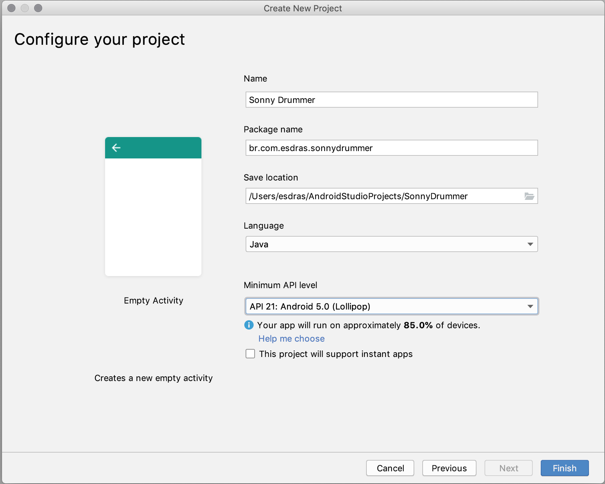

### 3. No explorador de arquivos, selecione o arquivo `activit_main.xml`.

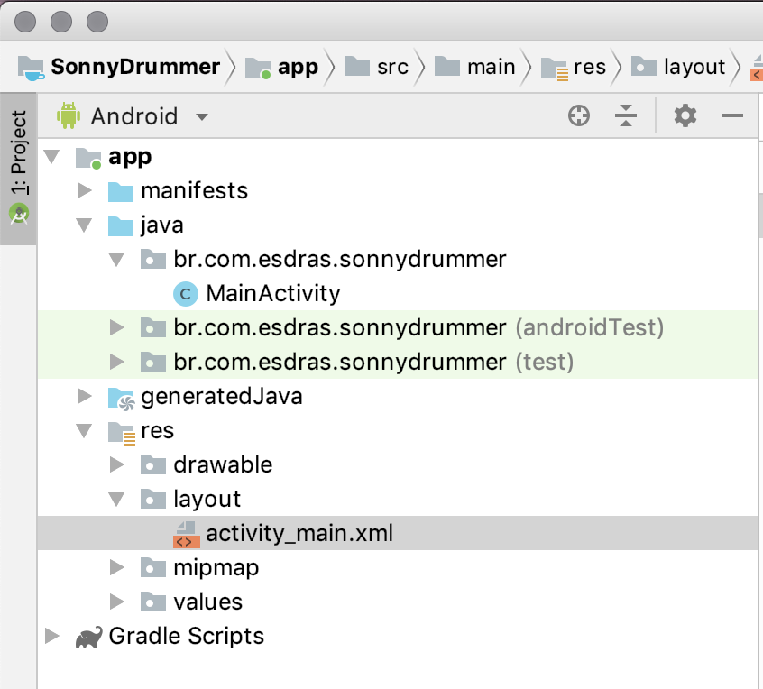

# Segunda Parte: Ajustar o layout para comportar 12 botões ocupando todo o espaço disponível na tela

## 1. Ajuste inicial da Activity

1. Remova o TextView `Hello World` do layout.


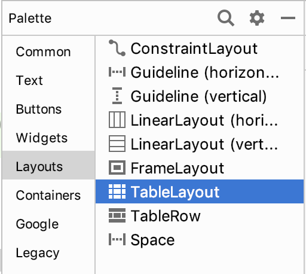

## 2. TableLayout
1. Na paleta de `Widgets`, seleciona a categoria **Layouts**.
2. Arraste o componente para o centro de nossa Activity.
3. Vamos ajustar as **constraints** do TableLayout na Activity:
  1. Selecione o componente **TableLayout** e utilize a `inferência de constraints`, conforme a imagem abaixo.
  2. Agora o TableLayout está devidamente **pregado** nas extremidades da tela.

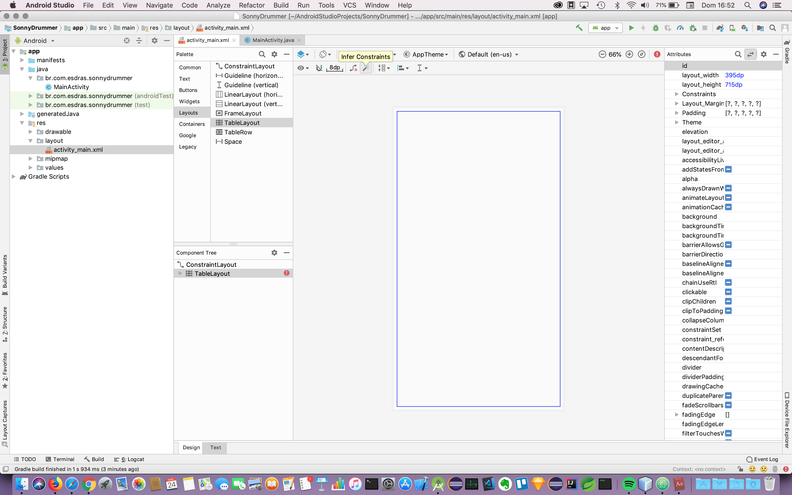

### 2.1 TableRow
1. Ainda no grupo Layouts, selecione o `Widget` TableRow.

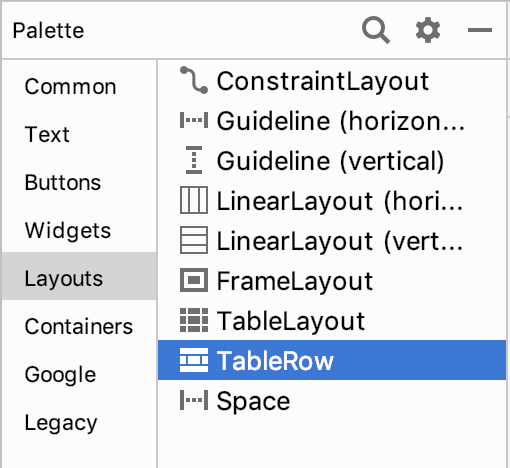

<hr>

2. Arraste um **TableRow** para dentro do **TableLayout**.

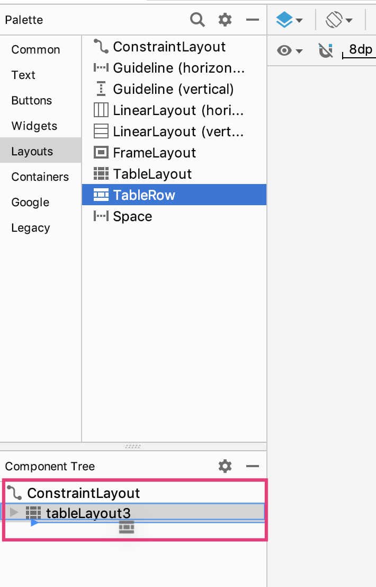

<hr>

3. Arraste tres botões para dentro do **TableRow**.

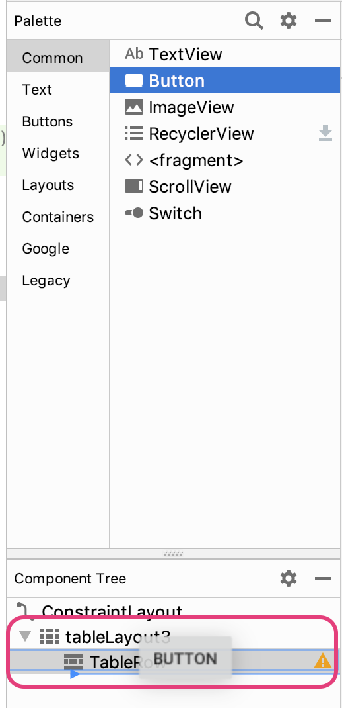

4. Com a **TableRow** com tres botoes embutidos, vamos ajustá-los para ocupar todo o espaço disponível na Activity.

5. Selecione a guia **Text**, ao lado do **Layout**, ambos na base do arquivo `activity_main.xml`.

6. Configure os **Widgets** (TableRow e Buttons) conforme a imagem abaixo.

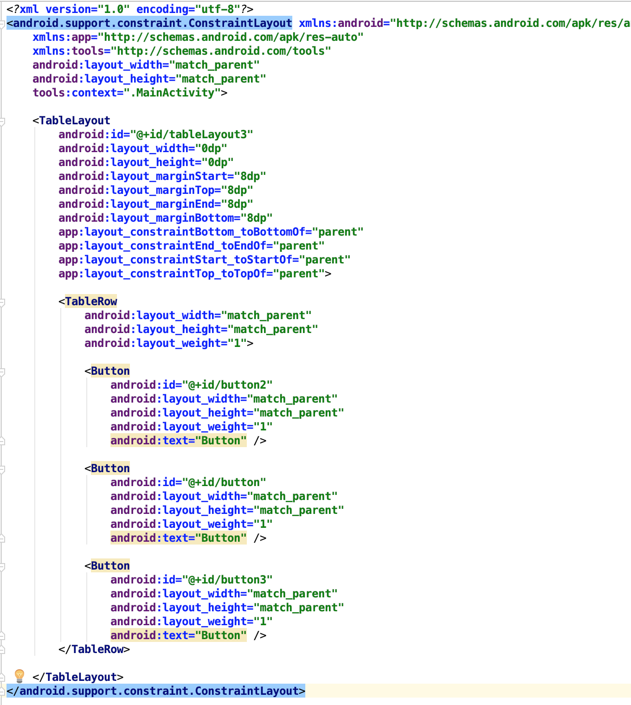

7. Neste momento o `activit_main` deve estar com os tres botões preenchendo toda a tela, conforme a imagem abaixo; então devemos replicar esta linha mais **3 vezes**.

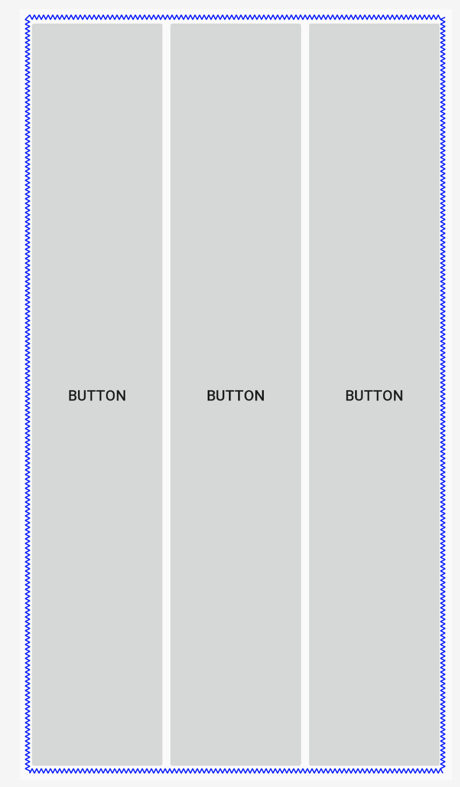

8. Copie o texto entre  tags `<TableRow>` ... `</TableRow>`  e ajuste os nome dos **IDs** dos botões.
9. Confira se seu código está em conformidade com o gabarito abaixo.

```javascript
<?xml version="1.0" encoding="utf-8"?>
<android.support.constraint.ConstraintLayout xmlns:android="http://schemas.android.com/apk/res/android"
    xmlns:app="http://schemas.android.com/apk/res-auto"
    xmlns:tools="http://schemas.android.com/tools"
    android:layout_width="match_parent"
    android:layout_height="match_parent"
    tools:context=".MainActivity">

    <TableLayout
        android:id="@+id/tableLayout3"
        android:layout_width="0dp"
        android:layout_height="0dp"
        android:layout_marginStart="8dp"
        android:layout_marginTop="8dp"
        android:layout_marginEnd="8dp"
        android:layout_marginBottom="8dp"
        app:layout_constraintBottom_toBottomOf="parent"
        app:layout_constraintEnd_toEndOf="parent"
        app:layout_constraintStart_toStartOf="parent"
        app:layout_constraintTop_toTopOf="parent">

        <TableRow
            android:layout_width="match_parent"
            android:layout_height="match_parent"
            android:layout_weight="1">

            <Button
                android:id="@+id/button1"
                android:layout_width="match_parent"
                android:layout_height="match_parent"
                android:layout_weight="1"
                android:text="Button" />

            <Button
                android:id="@+id/button2"
                android:layout_width="match_parent"
                android:layout_height="match_parent"
                android:layout_weight="1"
                android:text="Button" />

            <Button
                android:id="@+id/button3"
                android:layout_width="match_parent"
                android:layout_height="match_parent"
                android:layout_weight="1"
                android:text="Button" />
        </TableRow>

        <TableRow
            android:layout_width="match_parent"
            android:layout_height="match_parent"
            android:layout_weight="1">

            <Button
                android:id="@+id/button4"
                android:layout_width="match_parent"
                android:layout_height="match_parent"
                android:layout_weight="1"
                android:text="Button" />

            <Button
                android:id="@+id/button5"
                android:layout_width="match_parent"
                android:layout_height="match_parent"
                android:layout_weight="1"
                android:text="Button" />

            <Button
                android:id="@+id/button6"
                android:layout_width="match_parent"
                android:layout_height="match_parent"
                android:layout_weight="1"
                android:text="Button" />
        </TableRow>

        <TableRow
            android:layout_width="match_parent"
            android:layout_height="match_parent"
            android:layout_weight="1">

            <Button
                android:id="@+id/button7"
                android:layout_width="match_parent"
                android:layout_height="match_parent"
                android:layout_weight="1"
                android:text="Button" />

            <Button
                android:id="@+id/button8"
                android:layout_width="match_parent"
                android:layout_height="match_parent"
                android:layout_weight="1"
                android:text="Button" />

            <Button
                android:id="@+id/button9"
                android:layout_width="match_parent"
                android:layout_height="match_parent"
                android:layout_weight="1"
                android:text="Button" />
        </TableRow>

        <TableRow
            android:layout_width="match_parent"
            android:layout_height="match_parent"
            android:layout_weight="1">

            <Button
                android:id="@+id/button10"
                android:layout_width="match_parent"
                android:layout_height="match_parent"
                android:layout_weight="1"
                android:text="Button" />

            <Button
                android:id="@+id/button11"
                android:layout_width="match_parent"
                android:layout_height="match_parent"
                android:layout_weight="1"
                android:text="Button" />

            <Button
                android:id="@+id/button12"
                android:layout_width="match_parent"
                android:layout_height="match_parent"
                android:layout_weight="1"
                android:text="Button" />
        </TableRow>

    </TableLayout>
</android.support.constraint.ConstraintLayout>
```

10. O Layout deve estar com a seguinte aparência.

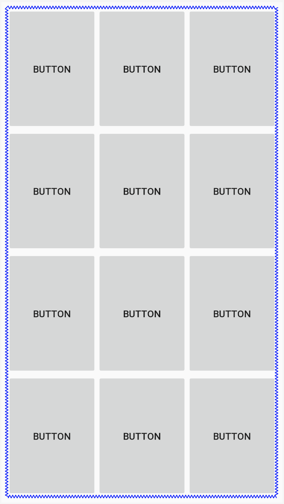


# Adicionar pacote de sons ao App.
1. Dentro da pasta `res`, crie uma nova pasta, um novo `Android Resource File` a pasta `raw`.
2. Dentro da pasta `raw`, cole os arquivos de audio para o `Sonny Drummer`.

# Código-Fonte SonnyDrummerÂ

```javascript
package com.example.tmlittledrummer;

import android.content.res.AssetManager;
import android.media.AudioManager;
import android.media.SoundPool;
import android.support.v7.app.AppCompatActivity;
import android.os.Bundle;
import android.util.Log;
import android.util.SparseIntArray;
import android.view.View;
import android.widget.Button;

import java.io.IOException;

public class MainActivity extends AppCompatActivity implements View.OnClickListener{


    //  Declaração de atributos e componentes
    private AudioManager mAudioManager;
    private SoundPool mSoundPool;
    private SparseIntArray mSoundMap;
    private Button button1, button2,button3,button4,button5,button6,button7,button8,button9,button10,button11,button12;
    private static final String TAG = "MainActivity";

    @Override
    protected void onCreate(Bundle savedInstanceState) {
        super.onCreate(savedInstanceState);
        setContentView(R.layout.activity_main);

        //  Obter Servico AudioManager
        mAudioManager = (AudioManager) getSystemService(AUDIO_SERVICE);

        //  Configurar o SounPoll para executar um som por vez
        //  Altere o primeiro parametro para poder executar varios sons em paralelo
        mSoundPool = new SoundPool(1,AudioManager.STREAM_MUSIC,0);

        //Load each sound and save their streamId into a map
        mSoundMap = new SparseIntArray();

        //<editor-fold desc="Declaracao de Botoes e associação de Listners" defaultstate=collapsed>
        //  Buttons
        button1 = findViewById(R.id.button1);
        button2 = findViewById(R.id.button2);
        button3 = findViewById(R.id.button3);
        button4 = findViewById(R.id.button4);
        button5 = findViewById(R.id.button5);
        button6 = findViewById(R.id.button6);
        button7 = findViewById(R.id.button7);
        button8 = findViewById(R.id.button8);
        button9 = findViewById(R.id.button9);
        button10 = findViewById(R.id.button10);
        button11= findViewById(R.id.button11);
        button12= findViewById(R.id.button12);

        button1.setOnClickListener(this);
        button2.setOnClickListener(this);
        button3.setOnClickListener(this);
        button4.setOnClickListener(this);
        button5.setOnClickListener(this);
        button6.setOnClickListener(this);
        button7.setOnClickListener(this);
        button8.setOnClickListener(this);
        button9.setOnClickListener(this);
        button10.setOnClickListener(this);
        button11.setOnClickListener(this);
        button12.setOnClickListener(this);
        //</editor-fold>


        //  Preenchimento de mapa contento o ID do botão como chave e o ID do WAV como value
        try{
            mSoundMap.put(R.id.button1, mSoundPool.load(getApplicationContext(),R.raw.um,1));
            mSoundMap.put(R.id.button2, mSoundPool.load(getApplicationContext(),R.raw.dois,1));
            mSoundMap.put(R.id.button3, mSoundPool.load(getApplicationContext(),R.raw.tres,1));
            mSoundMap.put(R.id.button4, mSoundPool.load(getApplicationContext(),R.raw.quatro,1));
            mSoundMap.put(R.id.button5, mSoundPool.load(getApplicationContext(),R.raw.cinco,1));
            mSoundMap.put(R.id.button6, mSoundPool.load(getApplicationContext(),R.raw.seis,1));
            mSoundMap.put(R.id.button7, mSoundPool.load(getApplicationContext(),R.raw.seis,1));
            mSoundMap.put(R.id.button8, mSoundPool.load(getApplicationContext(),R.raw.oito,1));
            mSoundMap.put(R.id.button9, mSoundPool.load(getApplicationContext(),R.raw.nove,1));
            mSoundMap.put(R.id.button10, mSoundPool.load(getApplicationContext(),R.raw.dez,1));
            mSoundMap.put(R.id.button11, mSoundPool.load(getApplicationContext(),R.raw.onze,1));
            mSoundMap.put(R.id.button12, mSoundPool.load(getApplicationContext(),R.raw.doze,1));

        } catch (Exception e) {
            e.printStackTrace();
            Log.e(TAG,"Error: "+e.getLocalizedMessage());
        }
    }

    @Override
    protected void onDestroy() {
        super.onDestroy();
        mSoundPool.release();
        mSoundPool = null;
    }

    @Override
    public void onClick(View view) {

        //  Verificar o numero do botao acionado
        String button = ((Button)view).getText().toString();
        Log.d(TAG,button);

        //  Obter o ID do som apropriado a partir do objeto que disparou o evento
        int streamId = mSoundMap.get(view.getId());

        if(streamId > 0){
            float streamVolumeCurrent = mAudioManager.getStreamVolume(AudioManager.STREAM_MUSIC);
            float streamVolumeMax = mAudioManager.getStreamMaxVolume(AudioManager.STREAM_MUSIC);
            float volume = streamVolumeCurrent / streamVolumeMax;

            //  Executar o som da pasta RAW
            mSoundPool.play(streamId,volume,volume,1,0,1.0f);
        }
    }
}

```
