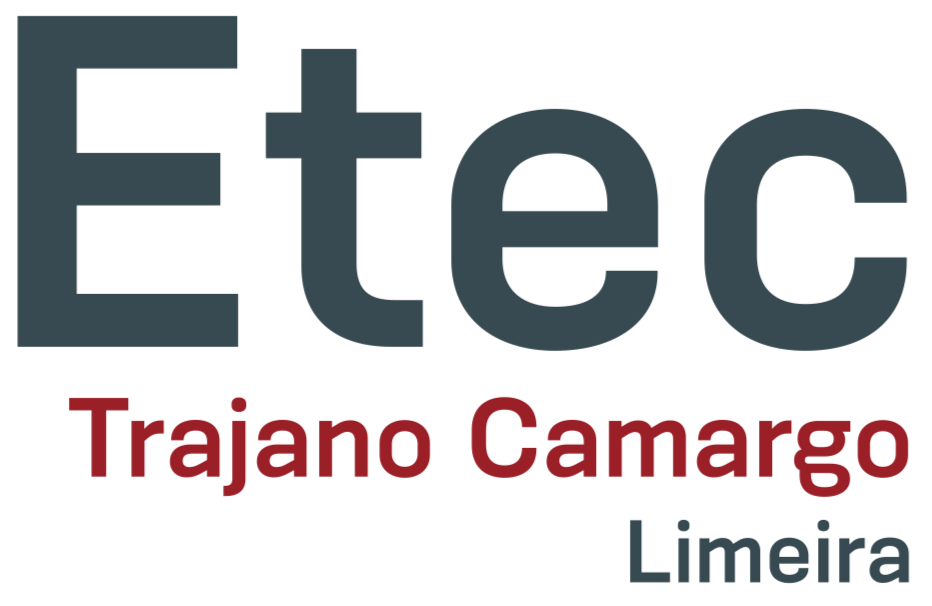
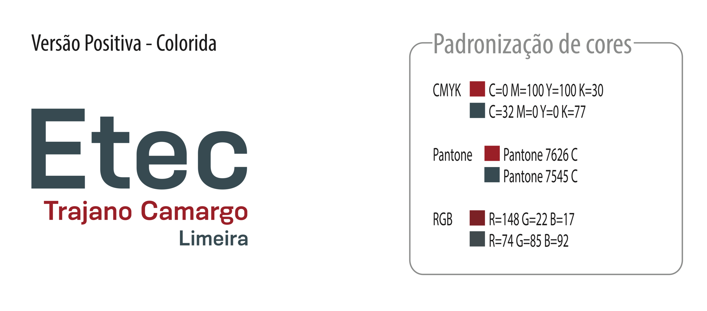

# Página de arquivos de apoio para as aula práticas do componente curricular Tecnologias para Mobilidade

A tabela abaixo traz instrucoes sobre a execucao dos aplicativos utilizados em sala de aula.

Data  |  Aplicação | Descrição  
--|---|--
**12/03/2019**  | [JoKenPo](JoKenPo/jokenpo.md)  |  Aplicativo que simula a bricadeira papel, tesoura ou pedra. Sua criação objetiva enfatizar os **Layouts**, **Intents** e **orientação a objetos** em uso de funções `Dialog`.  
**19/03/2019**  | [Little Drummer](LittleDrummerEx/littledrummer.md)  |  Aplicativo que simula a bricadeira papel, tesoura ou pedra. Sua criação objetiva enfatizar os **Layouts**, **Intents** e **orientação a objetos** em uso de funções `Dialog`.

